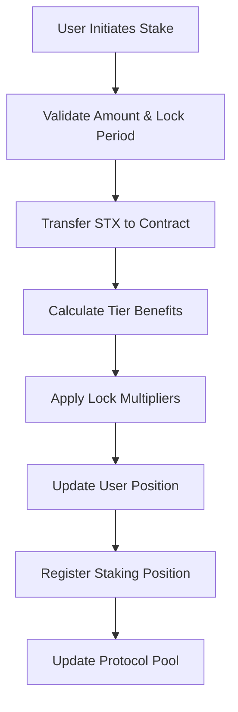
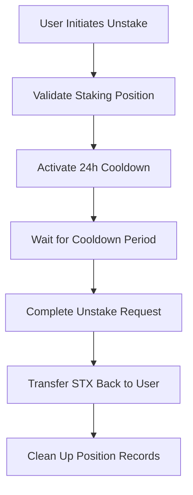

# YieldVault Protocol

> Revolutionary DeFi infrastructure delivering institutional-grade yield optimization through intelligent staking mechanisms on Bitcoin Layer 2

## Overview

YieldVault represents the pinnacle of decentralized finance engineering, architected specifically for the Bitcoin ecosystem via Stacks Layer 2. This protocol transforms traditional staking paradigms by introducing sophisticated yield amplification strategies, democratic governance frameworks, and enterprise-level security protocols.

The system operates through an innovative three-tier architecture that rewards commitment and scale, while maintaining absolute transparency and user sovereignty. Each tier unlocks progressively advanced features, creating natural incentives for deeper ecosystem participation.

## Revolutionary Features

- **Adaptive Yield Engine**: Dynamic APY calculations with intelligent multipliers
- **Democratic Governance**: Quadratic voting mechanisms ensuring fair representation  
- **Fortress Security**: Multi-layered protection with emergency circuit breakers
- **Enterprise Ready**: Compliance hooks and institutional-grade monitoring
- **Bitcoin Native**: Leveraging Proof of Transfer for unmatched security

## System Architecture

### Core Components

```
┌─────────────────────────────────────────────────────────────┐
│                    YieldVault Protocol                     │
├─────────────────────────────────────────────────────────────┤
│  ┌─────────────────┐  ┌─────────────────┐  ┌─────────────┐ │
│  │   Staking       │  │   Governance    │  │  Emergency  │ │
│  │   Engine        │  │   System        │  │  Controls   │ │
│  └─────────────────┘  └─────────────────┘  └─────────────┘ │
├─────────────────────────────────────────────────────────────┤
│  ┌─────────────────┐  ┌─────────────────┐  ┌─────────────┐ │
│  │   Tier          │  │   Reward        │  │  Security   │ │
│  │   Management    │  │   Calculator    │  │  Layer      │ │
│  └─────────────────┘  └─────────────────┘  └─────────────┘ │
└─────────────────────────────────────────────────────────────┘
```

### Three-Tier Staking System

| Tier | Minimum Stake | Reward Multiplier | Features |
|------|---------------|-------------------|----------|
| 🥉 **Bronze** | 1M μSTX | 1.0x | Basic staking |
| 🥈 **Silver** | 5M μSTX | 1.5x | Enhanced rewards + governance |
| 🥇 **Gold** | 10M μSTX | 2.0x | Maximum benefits + premium features |

## Contract Architecture

### Data Structures

#### Core Maps

- **`UserPositions`**: Comprehensive user profile management
- **`StakingPositions`**: Active staking position tracking
- **`TierLevels`**: Tier configuration matrix
- **`Proposals`**: Governance proposal registry

#### State Variables

- **`stx-pool`**: Total STX locked in protocol
- **`base-reward-rate`**: Base APY (5% = 500 basis points)
- **`minimum-stake`**: Entry threshold (1M μSTX)
- **`cooldown-period`**: Security delay (24 hours)

### Security Model

```
┌─────────────────────────────────────────┐
│            Security Layers             │
├─────────────────────────────────────────┤
│  Emergency Pause       │  Circuit       │
│  Mechanism            │  Breakers       │
├─────────────────────────────────────────┤
│  24-Hour Cooldown     │  Input          │
│  Period               │  Validation     │
├─────────────────────────────────────────┤
│  Access Controls      │  State          │
│  (Owner Only)         │  Verification   │
└─────────────────────────────────────────┘
```

## Data Flow

### Staking Process



### Unstaking Process



### Governance Flow

```mermaid
graph TD
    A[Proposal Creation] --> B[Voting Period Opens]
    B --> C[Quadratic Voting]
    C --> D[Vote Aggregation]
    D --> E[Proposal Resolution]
    E --> F[Execution (if passed)]
```

## API Reference

### Public Functions

#### Staking Operations

```clarity
(stake-stx (amount uint) (lock-period uint))
```

Stake STX tokens with optional lock period for enhanced rewards.

```clarity
(initiate-unstake (amount uint))
```

Begin the unstaking process with security cooldown.

```clarity
(complete-unstake)
```

Complete unstaking after cooldown period expires.

#### Governance Functions

```clarity
(create-proposal (description (string-utf8 256)) (voting-period uint))
```

Create a new governance proposal (requires 1M+ voting power).

```clarity
(vote-on-proposal (proposal-id uint) (vote-for bool))
```

Cast a weighted vote on an active proposal.

#### Administrative Controls

```clarity
(pause-contract)
(resume-contract)
```

Emergency controls for protocol security (owner only).

### Read-Only Functions

```clarity
(get-contract-owner) → (response principal never)
(get-stx-pool) → (response uint never)
(get-proposal-count) → (response uint never)
```

## Lock Period Options

| Period | Duration | Multiplier | Bonus |
|--------|----------|------------|-------|
| Flexible | 0 blocks | 1.0x | Standard rate |
| 30-Day | 4,320 blocks | 1.25x | 25% bonus |
| 60-Day | 8,640 blocks | 1.5x | 50% bonus |

## Reward Calculation

The protocol uses a sophisticated compound yield formula:

```
Rewards = (Stake × Base Rate × Tier Multiplier × Lock Multiplier × Time) / Precision
```

### Base Parameters

- **Base APY**: 5% (500 basis points)
- **Precision**: 14,400,000 (for accurate calculations)
- **Minimum Stake**: 1,000,000 μSTX

## Error Codes

| Code | Constant | Description |
|------|----------|-------------|
| 1000 | `ERR-NOT-AUTHORIZED` | Insufficient permissions |
| 1001 | `ERR-INVALID-PROTOCOL` | Protocol parameter violation |
| 1002 | `ERR-INVALID-AMOUNT` | Invalid amount specified |
| 1003 | `ERR-INSUFFICIENT-STX` | Insufficient STX balance |
| 1004 | `ERR-COOLDOWN-ACTIVE` | Cooldown period in progress |
| 1005 | `ERR-NO-STAKE` | No active staking position |
| 1006 | `ERR-BELOW-MINIMUM` | Below minimum stake requirement |
| 1007 | `ERR-PAUSED` | Contract is paused |

## Getting Started

### Prerequisites

- Stacks wallet with STX tokens
- Minimum 1M μSTX for Bronze tier entry
- Understanding of lock period implications

### Basic Usage

1. **Initialize Staking**

   ```clarity
   (contract-call? .yield-vault stake-stx u1000000 u0)
   ```

2. **Check Pool Status**

   ```clarity
   (contract-call? .yield-vault get-stx-pool)
   ```

3. **Participate in Governance**

   ```clarity
   (contract-call? .yield-vault create-proposal "Increase base reward rate" u1440)
   ```

## Development & Testing

### Running Tests

```bash
# Check contract syntax
clarinet check

# Run test suite
npm test
```

### Contract Verification

The contract includes comprehensive input validation and security checks to ensure protocol integrity.

## Security Considerations

- **24-hour cooldown** prevents rapid unstaking attacks
- **Emergency pause mechanism** for critical situations
- **Input validation** on all public functions
- **Access controls** for administrative functions
- **Overflow protection** in mathematical operations

## Governance Model

YieldVault implements a democratic governance system where:

- Voting power is proportional to staked amount
- Minimum 1M μSTX required to create proposals
- Quadratic voting ensures fair representation
- Time-limited voting periods prevent stagnation

## Roadmap

- ✅ Core staking functionality
- ✅ Three-tier reward system
- ✅ Governance framework
- ✅ Emergency controls
- 🔄 Advanced analytics integration
- 🔄 Cross-chain bridge compatibility
- 🔄 Institutional features
- 🔄 Mobile SDK

## Contributing

We welcome contributions to the YieldVault Protocol. Please ensure all code follows our security standards and includes comprehensive tests.
